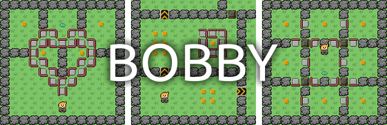

# Bobby



## Compilation

```shell
npm install
npm run serve # ou npm run build
```

## Remerciements

Merci à Aur36 pour son aide sur la réalisation de niveaux.

Merci à oräkle - Ethan G. pour son assistance graphique.

Merci à Alceste_ pour ses améliorations de code et de fonctionnement global.

Merci à Polyson pour sa proposition de niveaux à bords ouverts et ses divers
conseils et retours.

Merci aux membres de Bit My Code pour leur soutien dans le développement du
projet, et pour leurs divers retours.

## Inspirations

Ce jeu s'inspire de :

- [Pascal Penguin](http://www.luduminis.com/pascal/about/) ;

- Bobby Carrot ;

- Pokémon Rouge et Bleu.

## Bogues connus

- Lorsqu'on essaye de se déplacer vers un bloc solide, l'animation ne s'active
  qu'au moment où le clic est lâché. À la place, il ne faudrait soit aucun
  mouvement, soit un mouvement tout le long de l'appui ;

- La première ligne de définition d'un niveau fait preuve de largeur de ce
  niveau. Par conséquent le dernier bloc de la ligne définit la largeur de jeu.
  Cela peut poser problème si on souhaite ne pas mettre de bloc sur toutes les
  cellules de la première ligne ;

- Il y un flou de mouvement sur le joueur lors du déplacement de la caméra ;

- Lors de la téléportation d'un coté de l'écran à l'autre, le joueur subit une
  petite accélération involontaire après la téléportation ;

- Le déplacement lorsque trois touches sont appuyées n'est pas intuitif ;

- Lors du déplacement de la caméra, des traits fins apparaissent entre les
  blocs. Cela se voit notamment sur la glace ;

- Lorsqu'on charge un niveau qui n'a pas la forme initiale (carré) et qu'on
  revient au menu, celui-ci n'est pas remis à sa forme initiale.
